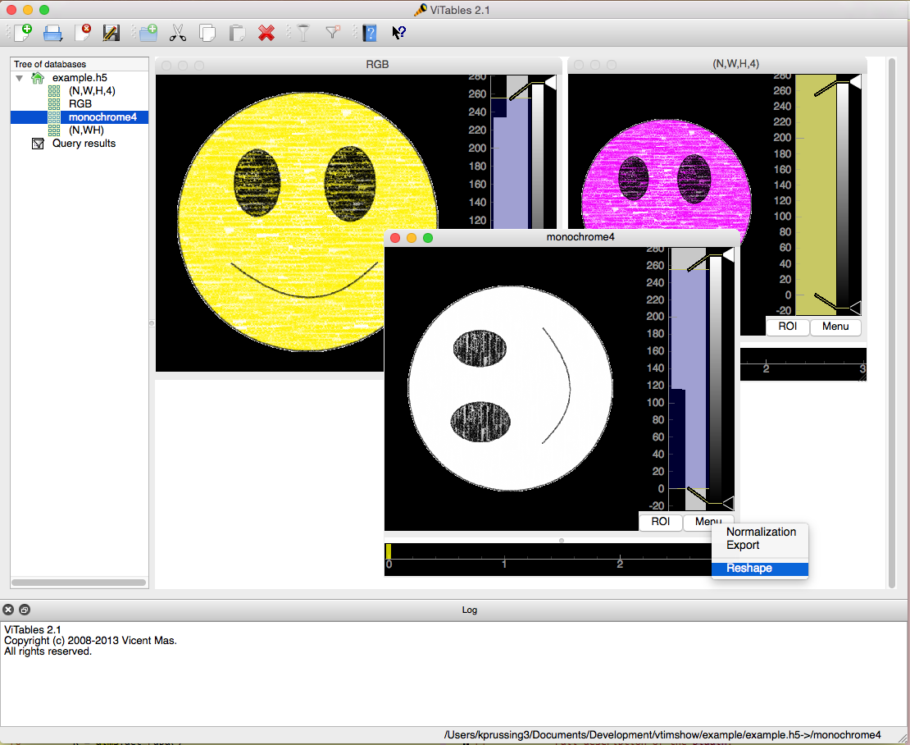

=====================
ViTables Image Viewer
=====================

This is a plug-in to ViTables_ to view data sets as images.  It uses
PyQtGraph_ to visualize the data sets in the workspace.  Valid viewable
data sets include 2D arrays (H,W) as monochrome images, 3D arrays as
RGB(A) (H,W,3) with or without the alpha channel, 3D arrays as N
monochrome images (N,H,W), and 4D arrays as N RGB(A) images (N,H,W,3).
A long term goal is to answer the problems addressed in `Issue #11`_.

This plug-in is designed to work with the development branch of ViTables
(2.2a1), and, therefore, uses ``setuptools`` to declare the entry points
into ``vitables.plugins``.

Screen Shot
-----------

Installation
------------

First, ensure that the correct version of ViTables_ and PyQtGraph_ are
installed.  The minimum version of ViTables necessary is (2.2a1) which
is currently the development branch.  The lowest know version of
PyQtGraph that has been tested is 0.9.10.  Once those dependencies have
been installed, run::

    $ python setup.py install

After running the install, launch ViTables, open the Preferences menu,
select the Plugins tab, and enable Image Viewer.  Once you restart
ViTables, you can right click on a data set and view it as an image.

Documentation
-------------

This project uses Sphinx_ to generate the typeset documentation.  To
build the HTML documentation along with the API, simply run::

    $ sphinx-apidoc -o . vtimshow -M
    $ make html

If you are on Windows, replace the last command with ``make.bat``.

Preferences
-----------

The default ordering of the arrays in the file is assumed to be (Depth,
Width, Height, RGB(A)).  To change this order, go to Preferences ->
image_viewer and select the proper order.  To have this persist, simply
hit save before exiting the preferences menu.

Image Math
----------

Two different methods are provided to do math operations on the data
sets.  The first performs operations within a single data set.  The
second performs operations on different but compatible data sets.

Frame Math
^^^^^^^^^^

A panel to perform math on selected frames is under the menu button at
the lower right of the image area.  Toggling this on will disable the
original frame selector used by the image area and the normalization
panel.  Instead, three frame selectors are placed in the time series
plot.  These correspond to R, G, and B channels.  In the panel, the user
may select to display these frames as a RGB image, subtracted monochrome
image, or divided monochrome image.

Cube Math
^^^^^^^^^

The cube math window allows for comparing data from different data sets.
After selecting up to three data sets, you can right click and select
“Compare Datasets” to bring up the window.  The red, green, and blue
channels each have a panel at the bottom where you can select the
appropriate data set for each color.  You can then use the slider or the
spin box to select the particular frame for processing.  The available
operations are listed in the panel to the right of the color assignment
panels.

Filter Plugins
^^^^^^^^^^^^^^

In addition to performing mathematical operations on the monochrome
frames from a data cube, the cube math panel provides a way to apply
filters to a full data cube.  On the far right of each color selector
row is a drop down menu to select a filter.  The selected filter is then
applied to the data cube to reduce it to a monochrome image.  Included
with this package are filters to apply a scaled human eye response for
the red, green, and blue colors.  These filters assume the data cube
maps on the full visible band and the response is scaled from 0 to 1.
Additional filters can be added by defining an entry point in your
``setup.py`` to the ``vtimshow.filters`` group.  The only requirements
are that the name of the filter must be unique, the target object must
have a ``name`` attribute that is used in the drop down menu, and the
target object must have a method ``compute(array)`` that accepts a
(N,H,W) NumPy array and reduces it to a (H,W) NumPy array.

Notes
-----

As noted in `Issue #33`_, the current development branch of ViTables
requires `setuptools-git` to work.  If you need to install ViTables from
an archived download, please refer to `this patch`_ to aid in
installation.

.. _ViTables: http://vitables.org
.. _PyQtGraph: http://www.pyqtgraph.org
.. _Sphinx: http://sphinx-doc.org/index.html
.. _Issue #11: https://github.com/uvemas/ViTables/issues/11
.. _Issue #33: https://github.com/uvemas/ViTables/issues/33
.. _this patch: https://github.com/kprussing/ViTables/commit/ef0ce8e2745ecb40ad8b45daa065b93551bac52c

